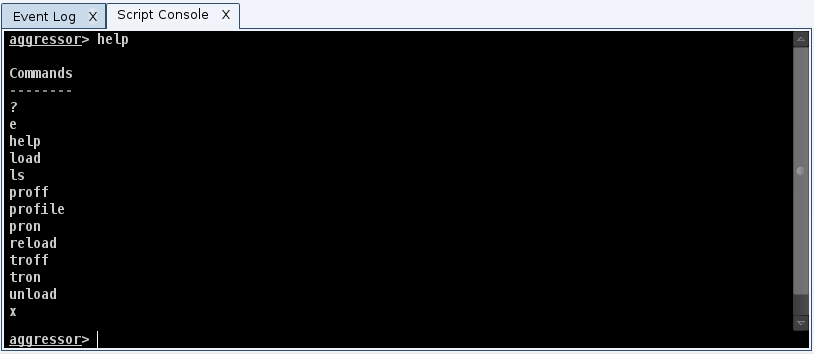

Introduction
===
## Aggressor Script简介
Aggressor Script 是 Cobalt Strike 3.0 或大于3.0的内置脚本语言，Aggressor Script 允许你修改和扩展 Cobalt Strike 客户端。  
### 历史
Aggressor Script 是 Armitage 的开源脚本引擎 Cortana 的接班人。Cortana 通过 DARPA's Cyber Fast Track 程序建立。 Cortana允许其用户通过Armitage的团队服务器扩展Armitage并控制Metasploit及其功能。Cobalt Strike 3.0是以无Armitage作为基础的 Cobalt Strike 重写。  这次变化直接提供了一个机会：重新考虑 Cobalt Strike's 脚本，并围绕 Cobalt Strike 的功能进行构建，这项工作的产出就是 Aggressor Script。  
Aggressor Script 是用于 red team 操作和对手模拟的脚本语言，灵感来自于可脚本化的IRC客户端和 bots 。其目的是双重的。您可以创建长时间运行的机器人，模拟虚拟红队成员，进行横向渗透。您还可以使用它来扩展和修改 Cobalt Strike 客户端以满足您的需求。
### 状态
Aggressor Script 是Cobalt Strike 3.0的基础部分。大多数弹出式菜单和 Cobalt Strike 3.0 中的事件演示由Aggressor Script 引擎管理。也就是说，Aggressor Script还处于起步阶段。 Strategic Cyber​​ LLC 尚未为大多数Cobalt Strike的功能构建API。期待看到Aggressor Script随着时间的推移而演变。此文档也是一项正在进行的工作。

## 加载Script
Aggressor Script 内置于 Cobalt Strike 客户端。要永久加载脚本，请转到 **Cobalt Strike** -> **Script Manager**，然后按加载。

## Script Console
Cobalt Strike提供了一个控制台来控制和与您的脚本进行交互。通过控制台，您可以跟踪，配置，调试和管理脚本。通过**View** -> **Script Console**可以使用Aggressor Script 控制台。  
以下命令可以用于控制台:

|Command| Arguments| 功能|
| ------------- |:-------------:| -----:|
|?|"*foo*" iswm "foobar"|执行Sleep条件表达式获取结果|
|e|println("foo");|执行Sleep语句|
|help||列出所有可用命令|
|load|/path/to/script.cna|加载Aggressor Script script|
|ls||列出所有加载的脚本|
|proff|script.cna|禁用Sleep脚本|
|profile|script.cna|脚本的性能统计信息|
|pron|script.cna|启用Sleep脚本|
|reload|script.cna|重新加载Sleep脚本|
|troff|script.cna|禁用script执行追踪|
|tron|script.cna|开启script执行追踪|
|unload|script.cna|卸载Sleep脚本|
|x|2 + 2|执行Sleep表达式获取结果|
||||

## Headless Cobalt Strike
您可以使用Aggressor Scripts 而不使用Cobalt Strike GUI。 **agscript** 程序（包括Cobalt Strike Linux软件包）运行着headless Cobalt Strike客户端。 agscript程序需要四个参数：
```
./agscript [host] [port] [user] [password]
```
这些参数将 headless Cobalt Strike客户端连接到您指定的团队服务器。headless Cobalt Strike 客户端提供了 Aggressor Scripts 控制台。 您可以使用agscript立即连接到一个团队服务器并运行您选择的脚本。使用：
```
./agscript [host] [port] [user] [password] [/path/to/script.cna]
```
该命令将 headless Cobalt Strike客户端连接到团队服务器，加载脚本并运行它。headless Cobalt Strike客户端将在与团队服务器同步之前运行脚本。使用准备等待headless Cobalt Strike客户端完成数据同步步骤。
```
on ready {
	println("Hello World! I am synchronized!");
	closeClient();
}
```
# Sleep简介
Aggressor Script 是基于Raphael Mudge's Sleep Scripting Language，手册在：[http://sleep.dashnine.org/manual](http://sleep.dashnine.org/manual)  

Aggressor Script 能做一切 Sleep 能做的事，这里有几件你应该知道的，以帮助你更清楚的认识sleep。
Sleep的语法，运算符和习语与Perl脚本语言相似。对于新程序员有一个主要的区别。Sleep 需要在操作符和他们的术语之间的空格。以下代码无效：
```
$x=1+2; # this will not parse!!
```
此声明是有效的：
```
$x = 1 + 2;
```
Sleep变量称为标量，标量保存字符串，各种格式的数字，Java对象引用，函数，数组和字典。以下是Sleep中的几项实例：
```
$x = "Hello World";
$y = 3;
$z = @(1, 2, 3, "four");
$a = %(a => "apple", b => "bat", c => "awesome language", d => 4);
```
使用@和％函数创建数组和字典。数组和字典可以引用其他数组和字典。数组和字典甚至可以引用自己。
注释以＃开头，直到行尾。
Sleep 插入双引号字符串。这意味着以$符号开头的任何白色空格分隔的符号将被其值替换。特殊变量$+将插入的字符串与另一个值连接。
```
println("\$a is: $a and \n\$x joined with \$y is: $x $+ $y");
```
输出结果:
```
$a is: %(d => 4, b => 'bat', c => 'awesome language', a => 'apple') and 
$x joined with $y is: Hello World3
```
有一个函数叫做&warn。它的作用类似于&println，除了它包括当前的脚本名称和行号。这是一个很好的功能来调试代码。
使用子关键字声明Sleep功能。函数的参数标注为$1，$2，一直到$n。函数将接受任意数量的参数。变量@_也是一个包含所有参数的数组。
```
sub addTwoValues {
	println($1 + $2);
}

addTwoValues("3", 55.0);
```
输出结果:
```
58.0
```
在Sleep中,函数是像其他任何对象一样的一类类型。以下是您可能会看到的几件事情：
```
$addf = &addTwoValues; 
```
$addf变量现在引用&addTwoValues函数。要调用一个包含在变量中的函数，请使用：
```
[$addf : "3", 55.0];
```
此括号符号也用于操作Java对象。如果您有兴趣了解更多信息，我建议您阅读“Sleep手册”。以下陈述是等效的，他们做同样的事情：
```
[$addf : "3", 55.0];
[&addTwoValues : "3", 55.0];
[{ println($1 + $2); } : "3", 55.0];
addTwoValues("3", 55.0);
```
Sleep有三个可变范围： global, closure-specific, local。Sleep手册更详细地介绍了这一点。如果在一个例子中看到本地（'$x $y $z'），这意味着$x，$y和$z是当前函数的本地函数，并且当函数返回时，它们的值将消失。睡眠使用词法作用域作为其变量。
Sleep具有您期望的脚本语言的所有其他基本结构。您应该阅读手册以了解更多信息。
## 用户交互
Aggressor Script使用Sleep &Println 、 &printAll 、&writeb和&warn函数显示输出。这些功能显示输出到脚本控制台。
脚本也可以注册命令。这些命令允许脚本通过控制台从用户接收触发器。使用 **command** 关键字注册一个命令：
```
command foo {
	println("Hello $1");
}
```
此代码段注册了命令foo。脚本控制台会自动解析命令的参数，并将它们由空格分割成令牌。 $1是第一个令牌，$2是第二个令牌，依此类推。通常，令牌由空格分隔，但用户可以使用“双引号”创建带有空格的令牌。如果此解析对您想要输入的内容造成破坏，请使用 **$0** 来访问传递给该命令的原始文本。

## Colors
您可以为Cobalt Strike的控制台中输出的文本添加颜色和样式。 \c，\U和\o转义告诉Cobalt Strile如何格式化文本。这些转义只能在双引号字符串中解析。
\cX转义使其后面的文字颜色。 X指定颜色。你的颜色选择是：

\U转义键强调了它后面的文字。第二个\U停止下划线格式。  
\o escape会重设文件后面的格式。换行符也会重设文本格式。


